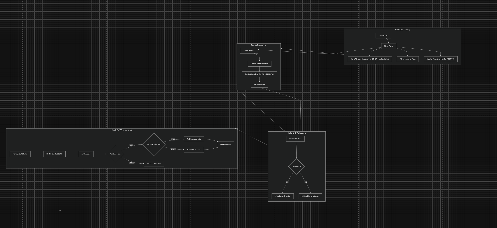

# Design Decisions & Trade-offs

## Architecture Overview

## Part 1 — Similarity Search

### Data Cleaning

The raw dataset had several messy fields that needed cleaning first.

The **weight** field was free text like "200 g" or "1.2 kg". About 79% of rows used 999999999 as a placeholder for missing weight. I parsed it to grams and treated the sentinel as missing.

The **sales_price** field was missing on about 10% of rows. I coerced it to a float and treated missing as unknown.

The **brand** field was missing on 27% of rows and had thousands of distinct values. Missing values became **UNKNOWN** and rare values were grouped into **OTHER**.

The **colour** field was missing on 80% of rows. I applied the same treatment as brand.

The **rating** field was always present and numeric. I used it as-is.

Ignoring this mess would have silently broken the similarity results. The weight sentinel alone would have dominated every distance calculation.

### Feature Vector

**Numeric fields** (**sales_price**, **weight_grams**, **rating**) were imputed with the column median. I used median instead of mean because price and weight were right-skewed. Then I applied z-score standardization to put all three on the same scale. Without this, price would have dominated the similarity score.

**Categorical fields** (**brand**, **colour**) were one-hot encoded. I capped each field to the top 200 values and bucketed the rest into **OTHER**. This kept the vector size bounded at around 400 dimensions. Missing values got their own **UNKNOWN** category so no product was excluded.

### Why Cosine Similarity

The feature vector mixed a few numeric dimensions with many sparse one-hot dimensions. Euclidean distance would have been dominated by the numeric dimensions in this setup. I chose cosine similarity because it normalizes for magnitude, so brand and colour matches contributed fairly.

### Tie-breaking

When two products had the same similarity score, I broke ties by rating first (higher was better). Then I used price as a secondary tie-breaker (lower was better). This was deterministic and made intuitive sense for recommendations.

### Complexity

Building the feature matrix was O(n). Each query ran one cosine similarity call against the full matrix, which was O(n*d). On this 30k-row dataset, that took about 54ms per query.

---

## Part 2 — FastAPI Microservice

### Index Built at Startup

I built the similarity index when the server started, not on the first request. This ensured the health endpoint only returned 200 when the service was truly ready. The first real request was also not slow.

### Error Handling

The exercise sample code raised raw exceptions. I mapped them to proper HTTP status codes instead.

An unknown product_id returned a 404. Invalid num_similar values returned a 422. Unexpected server errors returned a 500 with no internal details leaked.

### num_similar Cap

I capped num_similar at 100. An unbounded value could have been used to force expensive computation on every request. It also made no practical sense as a recommendation list.

### Two Approaches

The brute-force backend was exact and fast enough for 30k products. The FAISS backend was approximate but much faster at large scale. Both exposed the same interface. I defaulted to brute-force to avoid trading correctness for speed unnecessarily.

### Docker

The dataset zip is bundled inside the Docker image and extracted on first startup. This keeps the image smaller than copying the raw 74MB file directly.
