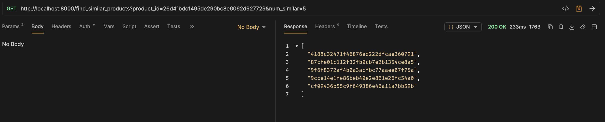

# Product Similarity Service

Finds similar products in the Amazon Fashion dataset by brand, colour,
sales_price, weight, and rating. Built for the SAP CXII technical
exercise.

## Quickstart

```bash
python -m venv .venv && source .venv/bin/activate
pip install -r requirements.txt

# data/archive.zip is bundled; the app auto-extracts it on first run.
uvicorn app.main:app --reload
# -> http://localhost:8000/find_similar_products?product_id=<id>&num_similar=5
```

Docker:

```bash
docker build -t product-similarity .
docker run -p 8000:8000 product-similarity
```

Part 3 benchmark (brute-force vs FAISS, latency + recall):

```bash
python scripts/build_index.py --num-queries 300 --k 10
```

---

## Part 1 — **find_similar_products**

The similarity logic, shared feature engineering, and dataset loading/cleaning modules.

### The dataset is messier than the exercise spec suggests

Before picking a similarity measure, the fields had to be cleaned:

| Field | Issue | Handling |
|---|---|---|
| weight | Free text ("200 g", "1.2 kg"); **79%** of rows use a 999999999 sentinel for "unknown" | Parsed to grams with unit conversion; sentinel and unparsable text → NaN |
| sales_price | Missing on ~10% of rows | Coerced to float; missing → NaN |
| brand | Missing on ~27%; thousands of distinct values | Missing → "UNKNOWN"; long tail capped to top-N (MAX_CATEGORY_VALUES, default 200) → "OTHER" |
| colour | Missing on ~80% (only ~6k/30k rows have it) | Same treatment as brand |
| rating | Clean — always present, always numeric | Used as-is |

Ignoring this and feeding raw strings/sentinels into a similarity measure
would silently break it — e.g. the 999999999 weight sentinel, treated as
a real value, would dominate every Euclidean distance calculation and make
weight the *only* thing that matters.

### Feature vector

- **Numeric** (sales_price, weight_grams, rating): median-imputed,
  then z-score standardized. Standardizing matters because the raw scales
  are wildly different (price in the hundreds/thousands vs. rating 0-5) —
  without it, price differences would dominate the distance regardless of
  brand or rating match. Median (not mean) imputation because price/weight
  are right-skewed; the median is a more representative "unknown" default.
  Missing values are imputed rather than dropped so a product missing one
  attribute isn't excluded from the whole catalog.
- **Categorical** (brand, colour): one-hot encoded, with missing values
  as their own "UNKNOWN" category and long-tail values bucketed into
  "OTHER". This keeps the vector's dimensionality bounded (~400 dims for
  this dataset) independent of catalog size — important once Part 3 needs
  to hold the whole matrix in memory for a vector index.

### Similarity measure: cosine, not Euclidean

The combined vector mixes a handful of dense numeric dimensions with many
sparse one-hot dimensions. Euclidean distance in that mix is dominated by
the numeric dimensions (they contribute large per-dimension differences)
and effectively ignores whether brand/colour match. Cosine similarity
normalizes for vector magnitude, so a strong categorical match (same
brand *and* colour) contributes proportionally rather than being drowned
out. This is also why standardizing the numeric features first still
matters even under cosine — without it, price alone could still dominate
the vector's direction.

### Tie-breaking

Per the exercise note ("tie-breaker can be based on any attribute"), ties
in cosine score are broken by rating (higher first), then price (lower
first) — deterministic, and a reasonable default recommendation ordering.

### Complexity

Brute-force: O(n) to build the matrix, O(n*d) per query (one
cosine_similarity call against the full matrix — ~54ms measured on this
30k-row, ~400-dim dataset). Fine at this scale; addressed for larger scale
in Part 3.

---

## Part 2 — FastAPI microservice

```
GET /find_similar_products?product_id=<id>&num_similar=<n>   -> ["id1", "id2", ...]
GET /health                                                    -> {"status": "ok", ...}
```

- num_similar is validated (1 <= num_similar <= MAX_NUM_SIMILAR, default
  cap 100) → 422 if out of range.
- Unknown product_id → 404, not a generic exception.
- Unexpected errors → 500, logged server-side, without leaking internals
  in the response.
- The index is built once at process startup (lifespan), not lazily on
  first request — so the first real request isn't slow.
- docker run's HEALTHCHECK targets /health.

---

## Part 3 (bonus) — vector search for scale

Two ANN backends implemented and benchmarked: **HNSW** and **IVF**, both via FAISS.

| Backend | Build time | Mean latency | p95 latency | Recall@10 |
|---|---|---|---|---|
| Brute-force | 0.06s | 20.6ms | 26.7ms | 1.00 (exact) |
| FAISS HNSW | 1.40s | 0.36ms | 0.60ms | 0.78 |
| FAISS IVF | 0.21s | 0.56ms | 0.77ms | 0.93 |

HNSW is fastest; IVF has better recall at ~1.5x the latency. Both are ~55x faster than brute-force per query.

Select backend via env var:
- **SIMILARITY_BACKEND=brute** (default) — exact, no build cost
- **SIMILARITY_BACKEND=faiss** — HNSW, best raw speed
- **SIMILARITY_BACKEND=ivf** — IVF, best recall among ANN options

**Note on Annoy:** Annoy was evaluated as a third candidate but has an unresolved segfault on Apple Silicon (ARM64) across all Python versions — a known open issue in the library ([github.com/spotify/annoy](https://github.com/spotify/annoy/issues)). It was not implemented for that reason. Theoretically, Annoy would be slower than HNSW at the same recall target — as shown in ANN-Benchmarks (Aumüller et al., 2020, [arXiv:1807.05614](https://arxiv.org/abs/1807.05614)) — making HNSW the better choice regardless.

See ANN_ALGORITHM_ANALYSIS for algorithm details, parameter tuning, and trade-off analysis.


---

## Other design decisions & trade-offs

- **Data shipped as data/archive.zip, not the extracted 74MB ldjson** —
  keeps the Docker image and git repo smaller; extracted once, lazily, on
  first run (see data_loader._ensure_data_file_present).
- **In-memory index only** — no persistence of the fitted feature matrix
  or FAISS index to disk. Fine for a single-node demo.
- **No image-based or text-embedding similarity** — the exercise's
  suggested attribute set (brand, colour, price, weight, rating) is
  entirely structured/tabular, so it didn't justify pulling in a CNN or
  transformer just to say the box was checked. Documented as a next step,
  not implemented, in the interest of the ~4-6h scope: product_name /
  meta_keywords are free text and would need TF-IDF or sentence
  embeddings; image_urls would need downloading + a pretrained CNN
  (ResNet/EfficientNet) for a visual embedding, combined with the
  structured score behind a configurable weight.
- **num_similar capped at 100** (MAX_NUM_SIMILAR) — an unbounded value
  is either meaningless (a "top-100000-similar" list isn't a
  recommendation) or a DoS vector (forcing a full O(n) sort per request).


## Expected Output & Results

The API returns a ranked list of similar product IDs. Below is a sample response from Bruno for **product_id=26d41bdc1495de290bc8e6062d927729&num_similar=5**:



**200 OK** — 5 similar product IDs returned in ~233ms (brute-force backend, cold start included).

---

## For more details - Kindly refer
DESIGN.md          
ANN_ALGORITHM_ANALYSIS.md

